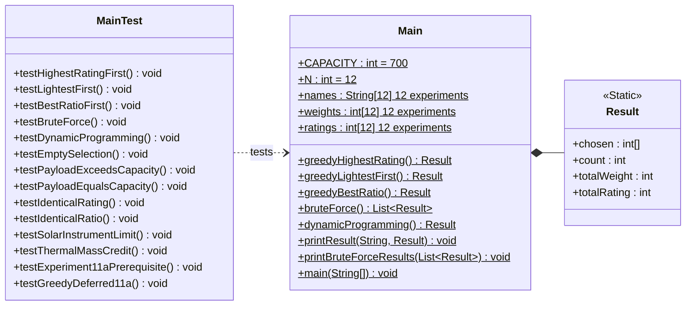

```mermaid
classDiagram
    direction LR

    class Main {
        +CAPACITY : int = 700$
        +N : int = 12$
        +names : String[12] 12 experiments$
        +weights : int[12] 12 experiments$
        +ratings : int[12] 12 experiments$
        +greedyHighestRating() Result$
        +greedyLightestFirst() Result$
        +greedyBestRatio() Result$
        +bruteForce() List~Result~$
        +dynamicProgramming() Result$
        +printResult(String, Result) void$
        +printBruteForceResults(List~Result~) void$
        +main(String[]) void$
    }

    class Result {
        <<Static>>
        +chosen : int[]
        +count : int
        +totalWeight : int
        +totalRating : int
    }

    class MainTest {
        +testHighestRatingFirst() void
        +testLightestFirst() void
        +testBestRatioFirst() void
        +testBruteForce() void
        +testDynamicProgramming() void
        +testEmptySelection() void
        +testPayloadExceedsCapacity() void
        +testPayloadEqualsCapacity() void
        +testIdenticalRating() void
        +testIdenticalRatio() void
        +testSolarInstrumentLimit() void
        +testThermalMassCredit() void
        +testExperiment11aPrerequisite() void
        +testGreedyDeferred11a() void
    }

    Main *-- Result
    MainTest ..> Main : tests
```
